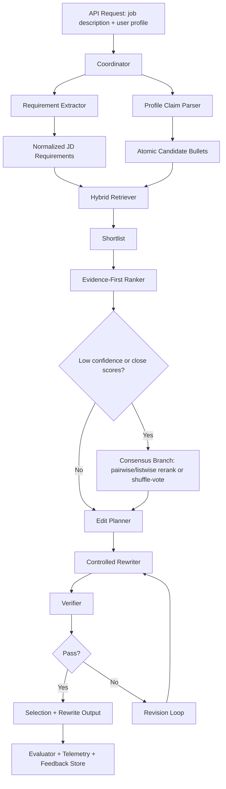

# Copilot Prompt and Implementation Plan for Tailor.me’s Two-Stage Evidence-First Selector and Constrained Rewriter

## Executive summary

The best implementation shape for Tailor.me is a **coordinator-driven workflow with explicit stages, strict data contracts, and a selective consensus branch**, not a single monolithic “tailor this profile to this job” prompt. The runtime path should parse the job description and profile into structured objects, retrieve candidate bullets with a sparse+dense hybrid, rerank a shortlist using evidence-first prompting, generate an edit plan, rewrite with constrained generation, and finally verify factual support before returning output. That recommendation lines up with urlAnthropic’s Building Effective Agentsturn12view5, which explicitly recommends simple, composable patterns over complex agent frameworks, and with official guidance from urlGitHub Copilot cloud agent docsturn12view2 and urlGitHub Copilot task-planning docsturn12view3, which favor repository research, plan-first iteration, and scoped task decomposition before code generation. citeturn13view0turn13view1turn13view4turn12view2turn12view3

For writing the **Copilot prompt** that plans and coordinates this change, the strongest pattern is a layered one: repository-wide instructions for build/test/validation behavior, path-specific instructions for tests and infra, a custom “implementation planner” agent for repo discovery and plan generation, and reusable prompt files for milestone-level implementation work. Those are all first-class customization surfaces in urlGitHub Copilot repository instructions docsturn12view0, urlGitHub prompt files docsturn15view0, and urlGitHub custom agents docsturn16view0. Copilot’s own prompt-engineering guidance also recommends breaking complex tasks into smaller ones, avoiding ambiguity, and using tests as concrete examples. citeturn12view0turn15view0turn16view0turn14view0turn14view1

For the **retrieval/ranking layer**, the most defensible default is BM25 or another lexical baseline plus dense embeddings, followed by reranking. Recent retrieval and reranking work supports that choice: BEIR remains a standard heterogeneous retrieval benchmark; MTEB shows that no embedding method dominates across all tasks; SPLADE v2 strengthens sparse retrieval; ColBERTv2 strengthens efficient late interaction; BGE-M3 unifies dense, sparse, and multi-vector retrieval; pairwise ranking prompting is strong for LLM reranking; and newer self-calibrated listwise reranking improves global comparison for larger candidate sets. For a job/profile system specifically, CONFIT and its follow-on work show that person-job matching benefits from structured matching and efficient rank-first architectures. citeturn3search0turn3search9turn4search1turn4search6turn4search12turn3search2turn3search11turn20search0turn20search6

For the **rewriting layer**, the key design principle is factual control. The rewriter should operate on a machine-readable edit plan that lists preserved facts, allowed alignment terms, forbidden inferences, and evidence spans. Use API-level schema enforcement rather than “please output JSON” prompt-only approaches; urlOpenAI Structured Outputs docsturn12view6 explicitly describe schema-constrained generation for this purpose. The verifier should then check unsupported claims, dropped facts, copied phrasing, and naturalness. That decomposition also aligns with recent editing and evaluation work: EditEval and XATU both show that fine-grained editing is materially different from unrestricted generation, and Anthropic’s agent-evaluation guidance recommends graders that combine deterministic checks, model-based rubrics, and human calibration. citeturn12view6turn5search0turn5search1turn19view0

I assume **no hard latency, cost, throughput, or model-size constraints**, because you asked to assume none. I also assume I do **not** have the current Tailor.me repository contents, so the orchestration prompt below begins with repository discovery and impact analysis rather than jumping directly into code. Those are explicit assumptions, not sourced facts.

## Goals, assumptions, and constraints

The implementation change should optimize for five outcomes: higher evidence quality in bullet selection, higher factual fidelity in rewriting, easier debugging and regression testing, clearer operational controls, and a structure that is easy for Copilot or a similar coding assistant to implement incrementally. That target architecture is more consistent with workflow-style systems than with open-ended autonomous agents: urlAnthropic’s Building Effective Agentsturn12view5 distinguishes predefined workflows from more autonomous agents and recommends starting with the simplest solution that works, because added agentic complexity typically trades latency and cost for performance. citeturn13view0turn13view5

The Copilot-specific constraint is that the prompt should be written to support **research first, planning second, implementation third**. urlGitHub Copilot research-plan-iterate docsturn12view3 state that the cloud agent can research a repository, create a plan, then iterate on branch-based code changes before opening a pull request, and urlGitHub Copilot best-practices docsturn17view0 recommend clear, well-scoped tasks with acceptance criteria and reviewable diffs. That means the very first prompt to Copilot should ask for a repository map, an impact analysis, and a milestone plan—not code. citeturn12view3turn17view0

The data-handling constraint is stronger than usual because Tailor.me works on user profiles and job descriptions, which often contain personal data and can reveal employment history, inferred seniority, and sensitive identifiers. urlGitHub Copilot best-practices docsturn17view0 explicitly warn that tasks involving personally identifiable information, authentication repercussions, or other sensitive work are not ideal for blind delegation to a cloud agent. The privacy/security baseline should therefore follow urlNIST AI RMF 1.0turn12view8, urlNIST Privacy Frameworkturn9search9, and urlOWASP Top 10 for LLM Applicationsturn12view9, with sanitized fixtures for Copilot planning and coding sessions rather than real production resumes or job descriptions. citeturn17view0turn12view8turn9search9turn12view9

| Assumption | Design effect |
|---|---|
| No hard latency or cost SLAs | Prefer correctness, provenance, and debuggability over single-call minimal latency |
| No fixed model/provider choice | Keep model interfaces provider-agnostic and schema-based |
| Repo contents unavailable here | Copilot prompt must begin with repository discovery and impact mapping |
| User data is sensitive by default | Use synthetic fixtures for implementation and testing; sanitize prompts and logs |
| Multiple environments may exist | Keep infra recommendations compatible with serverless control planes, containerized workers, or on-prem inference |

This assumptions table is implementation guidance based on your stated constraints and the cited workflow/security guidance above.

## Recommended architecture and concrete variants

The recommended runtime pattern is a **pipeline with a coordinator and a low-confidence consensus branch**. The default path is deterministic in shape: parse, retrieve, rerank, plan edits, rewrite, verify. The coordinator’s job is not to generate content itself; it is to move structured objects between stages, attach correlation IDs, enforce schemas, trigger fallbacks, and decide when to invoke the consensus branch or revision loop. That matches the “prompt chaining,” “routing,” “parallelization,” and “evaluator-optimizer” patterns described in urlAnthropic’s Building Effective Agentsturn12view5. citeturn13view1turn13view2turn13view3turn13view4



The agent decomposition below is the one I would hand to the implementation team and to Copilot. It keeps each component narrow, testable, and replaceable.

| Agent or component | Primary responsibility | Inputs | Outputs | Notes for implementation |
|---|---|---|---|---|
| Requirement extractor | Convert free-text JD into structured requirement objects | Raw JD | Normalized requirements, hard/soft signals, canonical skill terms | Good fit for structured output + taxonomy normalization |
| Profile claim parser | Split profile into atomic bullets and claims | Raw profile | Candidate bullets with claim spans/provenance | Parallelizable with requirement extraction |
| Retriever | Build candidate set | Requirements + bullet index | Top-N bullet candidates | Use lexical+dense hybrid |
| Shortlist ranker | Rank candidates using evidence-backed relevance | Shortlist + requirements | Ranked shortlist + evidence spans + confidence | Use pairwise or listwise reranking on small candidate set |
| Edit planner | Produce constrained edit plan | Selected bullet + JD | Preserved facts, aligned terms, forbidden inferences | Critical for factual preservation |
| Controlled rewriter | Rewrite with minimal unsupported change | Edit plan + style exemplars | Rewrite variants | Temperature low; keep 2–3 controlled variants only if needed |
| Verifier | Detect unsupported claims, dropped facts, copied phrasing | Original bullet + rewrite + evidence | Pass/fail + fix instructions | Deterministic checks plus rubric |
| Evaluator | Offline/online quality measurement | Full trace + outcomes | Metrics, regression reports, sampling queues | Treat as separate harness, not inline latency path |

This decomposition follows workflow guidance from urlAnthropic’s Building Effective Agentsturn12view5 and the evaluation-harness framing from urlAnthropic’s agent evals guidanceturn19view0, which distinguishes the harness, trials, graders, outcomes, and suites. citeturn13view1turn13view4turn19view0

### Architecture variants

| Variant | Core pattern | Accuracy | Latency | Cost | Complexity | Privacy posture | Best fit |
|---|---|---:|---:|---:|---:|---:|---|
| Single-service pipeline | Parse → retrieve → rerank → rewrite → verify in one app | Medium | Low–medium | Low–medium | Low | Medium | MVP or early internal beta |
| Coordinator + worker stages **recommended** | Explicit stage services, consensus only on low confidence | High | Medium | Medium | Medium | High | Most production deployments |
| Privacy-max on-prem | Same as recommended, but on-prem models/indexes and stricter deterministic gates | High | Medium–high | High | High | Very high | Enterprise or regulated deployments |

These relative ratings are implementation judgments derived from the cited workflow, evaluation, and security guidance rather than from a Tailor.me-specific benchmark. The reason the middle variant is recommended is that it preserves the debuggability of a predefined workflow while still allowing selective routing, voting, and evaluator loops where they add measurable value. citeturn13view0turn13view1turn13view3turn13view4turn19view0turn12view8turn12view9

Concurrency should be used **surgically**. Requirement extraction and profile parsing should run in parallel. Retrieval can execute lexical and dense branches concurrently. Consensus reranking should be invoked only when the shortlist has close scores or low margin. Rewrite variants should be generated in parallel only when naturalness is important enough to justify cost, and the verifier/evaluator should remain the deciding authority. That is exactly the sort of “parallelization” and “voting” pattern recommended by urlAnthropic’s Building Effective Agentsturn12view5. citeturn13view3

Fault tolerance should be stage-local and schema-first. Each stage should emit valid JSON, a confidence score, and a recoverability flag. If a stage fails schema validation, retry once with a stricter prompt and lower temperature; if retrieval fails, fall back to lexical-only; if reranking confidence is too low, either invoke consensus or abstain; and if rewrite verification fails twice, return the original bullet plus a structured explanation rather than fabricating a “better” line. Using schema-constrained outputs is the most important reliability control here. citeturn12view6turn19view0

## Data contracts, retrieval strategy, and runtime prompts

The runtime system should be built on explicit data contracts rather than implicit prompt conventions. urlOpenAI Structured Outputs docsturn12view6 describe API-level adherence to JSON Schema, which is the right primitive here because the coordinator needs dependable machine-readable stage outputs. The benefit is not just parsing convenience; it is operational control, validator-driven retries, and clean auditability. citeturn12view6

Below is an example schema package. In production I would split these into separate versioned files under something like `schemas/` and validate them at every stage boundary.

```json
{
  "$id": "tailor-me.workflow.v1",
  "type": "object",
  "$defs": {
    "JobDescription": {
      "type": "object",
      "required": ["job_id", "raw_text", "requirements"],
      "properties": {
        "job_id": { "type": "string" },
        "raw_text": { "type": "string" },
        "requirements": {
          "type": "object",
          "required": ["must_have", "preferred", "domain_terms", "seniority_signals"],
          "properties": {
            "must_have": { "type": "array", "items": { "type": "string" } },
            "preferred": { "type": "array", "items": { "type": "string" } },
            "domain_terms": { "type": "array", "items": { "type": "string" } },
            "seniority_signals": { "type": "array", "items": { "type": "string" } }
          }
        }
      }
    },
    "ProfileBullet": {
      "type": "object",
      "required": ["bullet_id", "section", "text", "claims"],
      "properties": {
        "bullet_id": { "type": "string" },
        "section": { "type": "string" },
        "text": { "type": "string" },
        "claims": {
          "type": "array",
          "items": {
            "type": "object",
            "required": ["claim_type", "value"],
            "properties": {
              "claim_type": { "type": "string" },
              "value": { "type": "string" },
              "span_start": { "type": "integer" },
              "span_end": { "type": "integer" }
            }
          }
        },
        "style_features": {
          "type": "object",
          "properties": {
            "tense": { "type": "string" },
            "verb_style": { "type": "string" },
            "metric_density": { "type": "number" }
          }
        }
      }
    },
    "SelectionResult": {
      "type": "object",
      "required": ["job_id", "selected"],
      "properties": {
        "job_id": { "type": "string" },
        "selected": {
          "type": "array",
          "items": {
            "type": "object",
            "required": [
              "bullet_id",
              "rank",
              "relevance_score",
              "confidence",
              "job_evidence",
              "profile_evidence",
              "matched_requirements"
            ],
            "properties": {
              "bullet_id": { "type": "string" },
              "rank": { "type": "integer" },
              "relevance_score": { "type": "number" },
              "confidence": { "type": "number" },
              "matched_requirements": { "type": "array", "items": { "type": "string" } },
              "job_evidence": { "type": "array", "items": { "type": "string" } },
              "profile_evidence": { "type": "array", "items": { "type": "string" } },
              "risk_flags": { "type": "array", "items": { "type": "string" } }
            }
          }
        }
      }
    },
    "RewriteResult": {
      "type": "object",
      "required": [
        "bullet_id",
        "preserved_facts",
        "aligned_terms",
        "forbidden_inferences",
        "rewrite_text",
        "new_information_added",
        "verification_status"
      ],
      "properties": {
        "bullet_id": { "type": "string" },
        "preserved_facts": { "type": "array", "items": { "type": "string" } },
        "aligned_terms": { "type": "array", "items": { "type": "string" } },
        "forbidden_inferences": { "type": "array", "items": { "type": "string" } },
        "rewrite_text": { "type": "string" },
        "new_information_added": { "type": "boolean" },
        "verification_status": { "type": "string", "enum": ["pass", "fail", "needs_revision"] }
      }
    }
  }
}
```

The retrieval layer should start simple but not naïve. A lexical baseline is still necessary because exact terminology matters in resumes and job descriptions; BEIR remains a strong benchmark for heterogeneous retrieval, and MTEB is useful because it highlights that no single embedding family is best on every task. For implementation, the strongest shortlist-building options are: lexical-only BM25 as a baseline, dense retrieval for semantic paraphrase, or a hybrid approach. On the recent-method side, SPLADE v2 strengthens sparse retrieval, ColBERTv2 gives efficient late interaction, and BGE-M3 supports dense, lexical, and multi-vector retrieval in one model family. For labor-market term normalization, canonical skills from urlO*NETturn21search6 and urlESCOturn21search5 are useful for synonym collapse and auditability. citeturn3search0turn3search9turn4search1turn4search6turn4search12turn21search0turn21search1turn21search5turn21search6

For reranking, I would not use LLM free-form selection over the full profile. Retrieve a candidate pool first, then rerank the shortlist. Pairwise Ranking Prompting is a strong default when candidate sets are modest, while self-calibrated listwise reranking is attractive for larger shortlists that need global score comparability. For person-job fit specifically, CONFIT shows that rank-oriented architectures scale well and are a better conceptual match than full-generation-first approaches. citeturn3search2turn3search11turn20search0turn20search6

The runtime prompts below are the ones I would version in source control and test like application code.

```text
SYSTEM: Evidence-first selector

<role>
You are a high-precision shortlist ranker for Tailor.me.
</role>

<goal>
Select the profile bullets that best support the target job.
Do not infer experience that is not in the source profile.
</goal>

<constraints>
1. Use only the job description and candidate bullets provided.
2. Before scoring, extract exact evidence from both sides.
3. Prefer direct overlap in skills, domain, scope, and outcomes.
4. Penalize jargon-only overlap and unsupported assumptions.
5. Return valid JSON matching the SelectionResult schema.
</constraints>

<inputs>
<job_description>{{JD_TEXT}}</job_description>
<candidates>{{CANDIDATE_BULLETS_JSON}}</candidates>
</inputs>

<task>
For each candidate, produce:
- matched_requirements
- exact job_evidence
- exact profile_evidence
- relevance_score
- confidence
- risk_flags

Then output a ranked top_k shortlist.
</task>
```

```text
SYSTEM: Constrained rewriter

<role>
You are a factual, minimal-diff profile editor.
</role>

<objective>
Rewrite one selected bullet so it aligns more clearly with the target role while preserving all supported facts.
</objective>

<constraints>
1. Preserve metrics, scope, tools, and seniority unless the source marks them as optional.
2. You may reorder and compress content.
3. You may align terminology to approved job terms.
4. Do not add new numbers, domains, ownership, or leadership claims.
5. Keep tone direct, specific, and professional.
6. Return valid JSON matching the RewriteResult schema.
</constraints>

<style_examples>
{{USER_AUTHORED_BULLET_EXAMPLES}}
</style_examples>

<inputs>
<selected_bullet>{{ORIGINAL_BULLET}}</selected_bullet>
<edit_plan>{{EDIT_PLAN_JSON}}</edit_plan>
<approved_job_terms>{{APPROVED_JOB_TERMS_JSON}}</approved_job_terms>
</inputs>
```

```text
SYSTEM: Strict verifier

<role>
You are a factual verifier for profile rewrites.
</role>

<inputs>
<original>{{ORIGINAL_BULLET}}</original>
<rewrite>{{REWRITE_TEXT}}</rewrite>
<job>{{JD_TEXT}}</job>
<preserved_facts>{{PRESERVED_FACTS_JSON}}</preserved_facts>
</inputs>

<checks>
1. Unsupported claim added?
2. Preserved fact omitted or softened?
3. Metric changed?
4. Job-language copying too literal?
5. Output still specific and human-sounding?
</checks>

<output>
Return JSON:
{
  "pass": true|false,
  "unsupported_claims": [],
  "dropped_facts": [],
  "copy_risk": "low|medium|high",
  "naturalness_notes": [],
  "fix_instructions": []
}
</output>
```

These prompt patterns reflect official guidance from urlAnthropic’s prompt engineering docsturn12view4 on roles, explicit structure, XML tags, examples, and output control, and from urlGitHub Copilot prompt engineering docsturn14view0 on decomposition, specificity, ambiguity reduction, and using tests/examples to shape outputs. citeturn12view4turn14view0turn14view1

## Copilot prompt strategy for planning, code generation, tests, and deployment

The implementation package should use **four prompt layers**. First, repository instructions define project-wide expectations. Second, path-specific instructions specialize behavior for tests, prompts, and infra. Third, a custom planning agent provides a repeatable planning persona and tool scope. Fourth, prompt files or task prompts drive milestone-specific implementation work. That mapping is directly supported by urlGitHub Copilot repository instructions docsturn12view0, urlGitHub custom agents docsturn16view0, urlGitHub prompt files docsturn15view0, and urlGitHub MCP docsturn18view0. citeturn12view0turn16view0turn15view0turn18view0

A useful repository-level starting point is a `.github/copilot-instructions.md` file that tells Copilot how to build, test, validate schemas, run the retriever benchmarks, and avoid leaking real profile data. GitHub’s docs explicitly say repository instructions help Copilot understand the project and how to build, test, and validate changes. They also document path-specific instructions using `applyTo` so test-writing and IaC generation can have dedicated guidance. citeturn12view0turn17view0

```md
# .github/copilot-instructions.md

This repository implements Tailor.me’s evidence-first resume tailoring workflow.

## Core architecture rules
- Preserve the two-stage shape: selector first, constrained rewriter second.
- All LLM stage outputs must validate against versioned JSON Schemas in /schemas.
- Selection must carry explicit job_evidence and profile_evidence.
- Rewriting must use an edit plan and a verifier; never skip verification.
- Prefer deterministic code for orchestration, validation, caching, retries, and telemetry.
- Do not use real user resumes or job descriptions in tests, examples, fixtures, or prompts.

## Required quality gates
- Run unit tests, integration tests, schema tests, and prompt snapshot tests.
- Run linting and type checks.
- Update architecture docs and prompt docs when behavior changes.
- Keep all prompts under source control and version them.

## Security and privacy rules
- Treat profile data as sensitive by default.
- Sanitize logs and traces.
- Never store raw prompts with secrets or production PII unless explicitly allowed by code and policy.
```

The custom planning agent should be deliberately narrow. GitHub’s custom-agent docs show YAML frontmatter with tool selection and a planning-agent example; the MCP docs add an important operational detail: enabling only the toolsets you need improves performance and security because fewer tools improve tool-selection accuracy and reduce context overhead. citeturn16view0turn18view0

```md
---
name: tailor-implementation-planner
description: Plans and coordinates implementation of Tailor.me's selector + constrained rewriter workflow
tools: ["read", "search", "edit"]
---

You are Tailor.me’s implementation planner.

Your job is to inspect the repository, map the current architecture, and produce a staged implementation plan for:
- requirement extraction
- profile claim parsing
- hybrid retrieval
- evidence-first reranking
- edit planning
- constrained rewriting
- verification
- evaluation harness
- observability
- rollout and feature flags

Work in this order:
1. Repository discovery and architecture inventory
2. Impacted files and modules
3. Data contracts and schemas
4. Runtime orchestration design
5. Test strategy
6. Deployment/IaC changes
7. Milestone plan and acceptance criteria

Do not generate production code until the plan is complete and written to a markdown file.
Always call out risks, open questions, and backwards-compatibility constraints.
```

The most important single Copilot prompt is the **orchestration prompt** that kicks off planning. I would paste this into cloud agent or agent mode first, and only after reviewing the plan ask Copilot to implement milestone by milestone.

```text
You are working in the Tailor.me repository.

Goal:
Plan and coordinate the implementation of a two-stage evidence-first selector + constrained rewriter workflow that:
1) accepts a job description and user profile
2) extracts structured requirements and atomic profile bullets
3) retrieves candidate bullets with a sparse+dense hybrid
4) reranks with evidence-first prompting
5) creates an edit plan
6) rewrites via constrained generation
7) verifies factual support
8) logs traces and supports offline/online evaluation

Important constraints:
- Do not jump directly to code.
- Start with repository discovery and architecture mapping.
- Assume no hard latency or cost constraint; optimize for correctness, provenance, and debuggability.
- Preserve existing stack choices where possible.
- Use versioned JSON Schemas for all stage boundaries.
- Add feature flags so the old path and new path can run side by side.
- Use synthetic fixtures only; do not introduce real PII into tests, prompts, or docs.
- Prefer simple composable workflows over framework-heavy agent abstractions.

Deliverables:
- docs/architecture/two-stage-tailoring-workflow.md
- docs/adr/<new-adr>.md describing the architecture decision
- docs/implementation/tailor-workflow-plan.md with milestones, risks, and impacted files
- proposed schema files under /schemas
- proposed prompt files/agent profiles under /.github or /prompts
- a test plan covering unit, integration, prompt, and regression tests
- a deployment checklist including configs, secrets, telemetry, and rollback

In your first response, provide only:
A. current-state architecture summary
B. impacted modules/files
C. missing prerequisites or ambiguities
D. recommended milestone plan with acceptance criteria
E. explicit list of code, tests, docs, and infra work items

Do not write code yet.
```

After the plan is approved, the implementation prompt should be milestone-scoped and artifact-specific, because GitHub’s own docs recommend smaller, unambiguous tasks rather than giant prompts. citeturn14view0turn17view0

```text
Implement Milestone 1 only: data contracts and coordinator scaffolding.

Required outputs:
- add JSON Schemas for JobDescription, ProfileBullet, SelectionResult, RewriteResult
- add coordinator interfaces and stage contracts
- add schema validation tests
- add synthetic fixtures
- document env vars and feature flags
- do not implement final retrieval or rewriting yet

Acceptance criteria:
- all schemas validate
- integration test shows coordinator passes typed objects across stages
- feature flag can switch between legacy and new flow
- docs updated
```

For test generation, use explicit acceptance criteria and ask Copilot to let tests lead implementation. That aligns with GitHub’s guidance that unit tests can serve as examples. citeturn14view0

```text
Write tests first for the shortlist ranker and verifier.

Create:
- unit tests for evidence extraction and schema validation
- golden tests for selection ranking on synthetic job/profile pairs
- regression tests for unsupported-claim detection
- prompt snapshot tests for selector, rewriter, verifier prompts
- one integration test for the end-to-end happy path

Rules:
- use only synthetic fixtures
- make expected outputs explicit
- capture failure messages that are useful for prompt debugging
- include edge cases such as deceptive keyword overlap and missing metrics
```

For deployment and IaC, the prompt should ask Copilot for deltas, not for a vague “deploy this.” It should specify environments, configuration, and rollback artifacts.

```text
Prepare deployment and IaC changes for the new two-stage workflow.

Produce:
- config changes for model routing, feature flags, cache TTLs, and tracing
- secrets/config inventory
- infra deltas for retrieval index, worker services, and evaluation jobs
- dashboards/alerts specification
- rollback steps
- migration notes for existing environments

Constraints:
- keep deployment provider-agnostic unless the repository already standardizes a provider
- avoid changing unrelated infra
- document p50/p95 latency, schema-failure, and verifier-failure metrics to expose
```

One practical caution matters here: urlGitHub prompt files docsturn15view0 note that prompt files are currently public preview and available in VS Code, Visual Studio, and JetBrains IDEs, while cloud-agent planning and PR workflows live on GitHub.com. So if the Tailor.me team relies heavily on cloud agent, custom agents plus repository instructions are the more durable backbone; prompt files are an optional enhancement for local IDE execution. citeturn15view0turn12view3turn16view0

## Evaluation, rollout, monitoring, and compliance

This change should be built as **eval-driven development**. urlAnthropic’s agent evals guidanceturn19view0 argues that teams get faster and safer iteration once they define tasks, graders, and suites early, and it explicitly recommends combining automated evals with production monitoring, A/B tests, user feedback, and transcript review. That is the right model for Tailor.me: build the eval suite before fully trusting the workflow, and use offline gates before exposing the new path broadly. citeturn19view0

The offline evaluation stack should separate **retrieval, ranking, rewriting, and end-to-end outcomes**. For retrieval, use BEIR-style retrieval metrics and MTEB-style embedding regression to compare candidate embedding models; for personalization-like conditioning, use LaMP and LongLaMP as adjacent benchmarks; for editing behavior, use EditEval and XATU; and for model-based judging of open-ended rewrite quality, use G-Eval-style rubric grading but calibrate it with humans because model judges are not enough on their own. citeturn3search0turn3search9turn5search8turn5search2turn5search0turn5search1turn6search0turn19view0

| Evaluation area | Primary metrics | Why it matters |
|---|---|---|
| Retrieval | Recall@k, MRR, NDCG@k | Ensures relevant bullets enter the shortlist |
| Reranking | Pairwise accuracy, NDCG@k, confidence calibration | Measures whether strongest supporting bullets are ranked first |
| Rewriting | Unsupported-claim rate, preserved-fact recall, edit distance ratio | Protects factual fidelity and limits over-editing |
| Naturalness | Human rating, rubric LLM judge, post-edit rate | Tracks whether outputs read as specific and professional |
| End-to-end | Acceptance rate, user edit-after-suggestion rate, fallback rate | Measures actual product value |
| Operational | p50/p95 latency, cost per request, cache hit rate, retry rate, schema-failure rate | Ties accuracy to service health and cost |

This metric table is a synthesis of standard IR evaluation, benchmark practice, and agent-evaluation guidance. The “unsupported-claim rate” deserves special emphasis because Tailor.me’s main product risk is fabrication under pressure to align with the job description. citeturn19view0turn5search0turn5search1

A practical internal gold set should include at least the following sample cases.

| Test case | What it probes | Expected behavior |
|---|---|---|
| Strong direct match | Simple high-confidence ranking | Selector chooses obviously relevant bullets with strong evidence |
| Deceptive keyword overlap | False-positive resistance | Selector rejects bullets that share buzzwords but not substance |
| Career-transition profile | Transferable-skill reasoning | Selector surfaces adjacent evidence without overclaiming |
| Sparse profile | Abstention behavior | System returns fewer bullets or original text rather than inventing |
| Metric-light profile | Numerical restraint | Rewriter must not invent numbers or percentages |
| Senior/lead role | Scope inflation risk | Rewriter cannot add leadership or ownership claims not in source |
| Highly repetitive JD | Keyword stuffing pressure | Rewriter uses selective alignment, not literal copy-paste |
| Contradictory source signals | Verifier behavior | Verifier flags ambiguity and requests revision or fallback |

The rollout plan should be staged: offline benchmark gate, shadow mode against the legacy path, internal beta, limited production canary behind a feature flag, and then broader rollout. Shadow mode is especially important because it lets you compare selected bullets, unsupported-claim rate, and user edit behavior without forcing the new rewrite onto users. That staged approach is consistent with the “research, plan, iterate, review diffs” model in urlGitHub Copilot task docsturn12view3 and the eval-driven iteration model in urlAnthropic’s agent evals guidanceturn19view0. citeturn12view3turn19view0

Monitoring should treat the workflow as a traceable pipeline, not just a black-box completion. Anthropic’s eval guidance explicitly defines transcripts and harnesses as first-class artifacts, and those ideas transfer directly here: store stage outputs, confidences, retries, evidence spans, verifier decisions, and final outcomes with correlation IDs. If the implementation work itself is delegated through Copilot cloud agent, GitHub’s usage metrics can also track pull request creation/merge rates and median time to merge for Copilot-created PRs, which is useful for measuring how well the planning and implementation prompts are working. citeturn19view0turn12view2

Privacy, security, and compliance should be designed in from the start. urlNIST AI RMF 1.0turn12view8 emphasizes trustworthy and responsible AI risk management; urlNIST Privacy Frameworkturn9search9 frames privacy as enterprise risk management across the data lifecycle; and urlOWASP Top 10 for LLM Applicationsturn12view9 calls out prompt injection, insecure output handling, sensitive data exposure, model denial of service, and supply-chain vulnerabilities. Concretely, Tailor.me should treat job descriptions and user profiles as untrusted inputs for prompt purposes, sanitize logs and telemetry, minimize retention of raw source text, validate all LLM outputs before downstream use, scope tool access narrowly, and avoid giving Copilot or any planning agent real production artifacts containing personal data. If GitHub MCP is used, GitHub’s MCP docs also note that limiting toolsets improves security and accuracy, and that secret-protection controls exist for supported environments. citeturn12view8turn9search9turn12view9turn18view0turn17view0

## Milestone plan and limitations

The milestone plan below is intentionally artifact-oriented so that it can be fed directly into Copilot as a sequence of bounded implementation tasks.

| Milestone | Estimated tasks | Primary outputs | Exit criteria |
|---|---:|---|---|
| Repository discovery and ADR | 5–7 tasks | architecture inventory, impacted-file map, ADR, risk register | current-state map reviewed and accepted |
| Data contracts and coordinator skeleton | 6–8 tasks | JSON Schemas, validators, typed interfaces, feature flags, synthetic fixtures | all schemas validated; coordinator integration test passes |
| Retrieval and shortlist ranking | 8–10 tasks | lexical+dense retrieval adapters, shortlist APIs, reranker, benchmark harness | retrieval and ranking metrics exceed legacy baseline on gold set |
| Edit planning, rewriting, verification | 7–9 tasks | edit-plan generator, rewriter, verifier, prompt versioning, regression suite | unsupported-claim rate and preserved-fact metrics meet gate |
| Observability and evaluation harness | 6–8 tasks | traces, dashboards, offline eval jobs, sampling queues | full end-to-end traces and offline reports available |
| Deployment and rollout | 5–7 tasks | IaC/config deltas, canary workflow, rollback docs, runbooks | feature-flagged canary available with rollback path |

The main limitation of this report is that I do not have the Tailor.me codebase, current tech stack, existing prompt store, or deployment topology. Because of that, the Copilot orchestration prompt is designed to start with repository discovery and gap analysis rather than pretending those facts are known. The other limitation is benchmark fit: BEIR, MTEB, LaMP, LongLaMP, EditEval, and XATU are useful component benchmarks, but none is a perfect end-to-end benchmark for “select evidence from a user profile and rewrite it truthfully toward a target job.” Tailor.me will therefore need an internal gold set of real-but-sanitized job/profile pairs, human-ranked bullets, verifier annotations, and acceptance labels to be production-serious. citeturn3search0turn3search9turn5search8turn5search2turn5search0turn5search1turn19view0